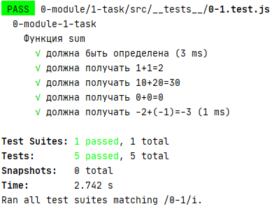
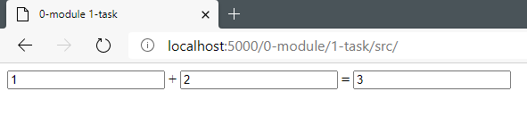

# 1-task

Напишите функцию сложения двух чисел, которая принимает на вход два числа в виде строк, а возвращает сумму переданных чисел, либо выбрасывает TypeError.

###### Результат

---

**- Для решения отредактируйте файл `script.js`**

**- Доступно автоматическое тестирование**
